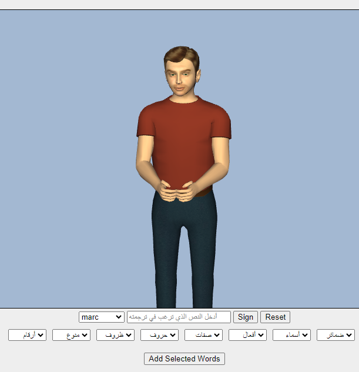

# Algerian Sign Language 3D-Avatar

## Overview
This project is an **Automated Arabic Algerian Sign Language (ALSL) Translation System** that utilizes **3D avatar technology** to translate Arabic text into dynamic ALSL gestures. The system is designed to improve accessibility and communication for the **deaf community** in Algeria. 

The translation engine relies on:
- **HamNoSys (Hamburg Notation System)** for encoding ALSL gestures.
- **SiGML (Signing Gesture Markup Language)** for generating animated sign language.
- **CWASA (CWA Signing Avatars)** for rendering the 3D avatar’s sign language animations.

The system currently supports a dictionary of **417 ALSL words** with a certified accuracy rate of **75.53%**.

## Features
✅ **Real-time ALSL translation** from Arabic text to 3D avatar gestures.  
✅ **Lexicon of ALSL gestures**, built using HamNoSys and validated by sign language experts.  
✅ **Web-based interface** for accessibility and ease of use.  
✅ **Integration with CWASA avatar rendering** for accurate sign representation.  

## Live Demo 🖥️
Try the **Algerian Sign Language 3D avatar** here:  
🔗 [3D ALSL Demo](https://3dasl-avatar.vercel.app/)

## Project Structure
```
.
├── data
│   ├── categories_files.json
│   └── sigml/ (Contains SiGML files for ALSL words)
├── docs
│   ├── images/ (Project-related images and screenshots)
│   ├── asl-3d-avatar-master-memory.pdf (Master thesis documentation)
│   ├── NAFATH-4th-ID-141-ALSL2024.pdf (Research paper)
├── source-data
│   ├── words.ods (Dataset containing ALSL words)
│   ├── [Various categories of SiGML files]
├── tests
│   ├── extract_data_word_list.py (Script for extracting word lists)
│   ├── output/ (Generated test data)
├── tools
│   ├── import_fr_sigml_to_arabic.py (Script for importing French Sign Language to Arabic Sign Language)
├── web-simulator
│   ├── avatars/ (3D avatar models)
│   ├── index.html (Web interface for testing the system)
│   ├── shaders/ (Rendering scripts)
└── README.md
```

## Installation & Setup 🚀
### Prerequisites
- Python (for preprocessing scripts)
- Web browser (for running the simulator)

### Running the Web Simulator
```bash
cd web-simulator
python -m http.server 8000
```
Then, open your browser and visit:
```
http://localhost:8000
```

## Screenshots 📸


## Resources & Links 🔗
- [Algerian Sign Language (FaceBook page)](https://www.facebook.com/profile.php?id=100093996740140)
- [DictaSign Project](https://www.sign-lang.uni-hamburg.de/dicta-sign/portal/concepts/concepts_fre.html)
- [HamNoSys Notation System](https://www.sign-lang.uni-hamburg.de/hamnosys.html)
- [SiGML (Signing Gesture Markup Language)](https://vh.cmp.uea.ac.uk/index.php/SiGML)
- [CWASA Signing Avatars](https://vh.cmp.uea.ac.uk/index.php/CWA_Signing_Avatars)

## Citation & Documentation 📚

If you use this project in your research, please cite:

### Master Thesis
* [PDF](docs/asl-3d-avatar-master-memory.pdf)  Amine Mami, Mohamed elFares Slimani, *Automated Arabic Algerian Sign Language Translation System Based on 3D Avatar Technology*, Final Master Project, Dept. of Mathematics and Computer Science, Faculty of Sciences, Yahia Fares Univ. of Médéa, 2023-2024.
  
  ```
  @mastersthesis{Mami2024,
    author    = {Amine Mami and Mohamed Elfares Slimani},
    title     = {Automated Arabic Algerian Sign Language Translation System Based on 3D Avatar Technology},
    school    = {Yahia Fares University of Médéa},
    year      = {2023-2024}
  }
  ```

### Research Paper
* [PDF](NAFATH-4th-ID-141-ALSL2024.pdf)  Amine Mami, Mohamed elFares Slimani,  Taha Zerrouki and and Redha Mazari, “Arabic Algerian Sign Language Translation System Based on 3D Avatar Technology,” *Nafath*, Mada Center, Qatar, 2024.
  
  ```
  @article{Mami-nafath2024,
    author    = {Amine Mami, Mohamed Elfares Slimani, Taha Zerrouki, Redha Mazari},
    title     = {Arabic Algerian Sign Language Translation System Based on 3D Avatar Technology},
    journal   = {Nafath},
    year      = {2024},
    publisher = {Mada Center, Qatar}
  }
  ```

## Acknowledgment 🙌
We sincerely thank **Mr. Youcef Benyahia** for his expert contributions to our **3D avatars and animations**. Special thanks to **Mrs. Dharbou Maroua**, whose dedication as a **sign language specialist** greatly enhanced the quality of over 300 Algerian Sign Language (ASL) gestures. We are also grateful to the **teachers of the School for the Deaf in Beni Slimane, Medea**, for their essential feedback during prototype testing.

## Contributors 👥

- [Amine Mami](@TheCongres)
- [Mohamed Elfares Slimani](@faresS69)
- [Taha Zerrouki](@linuxscout) (Supervisor)
- Redha Mazari

## License 📜
This project is licensed under **CC BY-NC-4.0**.

---
🎯 *This project aims to bridge the communication gap for the deaf community in Algeria using cutting-edge 3D avatar technology. Your contributions and feedback are welcome!*

